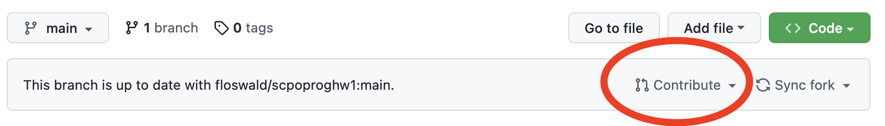

# Programming Course Homework 1

Hi folks! Ok, here is your first homework. 

## Logistics

* You have time until March 1st
* You **must** do the homework in teams of 2 or 3 students

## Submitting via Pull Request (PR)

Now you are real github pros 👷🏻‍♀️👷🏾‍♂️👩🏽‍💻👨🏻‍💻 so you will submit this via _pull request_. Let me take you through it.

### Setting up your copy of this repo: Create a *Fork*

1. Towards the right of this page, search for the _Fork_ button. Click it. This will setup a copy of this repo on your own user space. Wait a moment. We will end up on _your_ github user space, at `YOUR_USERNAME/scpoproghw1`. Stay there.
2. Let's get this repo onto your computer. Click the green button (`<> Code`) and copy the SSH URL (i.e. something like `git@github.com:YOUR_USERNAME/scpoproghw1.git`)
3. open the terminal on your computer. where you type `bash` commands.
4. choose a suitable location for your homeworks. I'll assume you choose to put them in `~/scpoproghw`. execute this:
    ```bash
    mkdir -p ~/scpoproghw  # make that directory
    cd ~/scpoproghw # go there
    git clone git@github.com:YOUR_USERNAME/scpoproghw1.git 
    ```

## Do The Job 💪🏽

* Ok great, good to go. 
* Start the VSCode editor and open the local repo. If you were following along, that means opening `~/scpoproghw/scpoproghw1` in VSCode (do that from withing VSCode, not on the command line)
* Open the `script.sh` file. You need to fill in some bits and pieces, and run it frequently to check that it does what you want.
* Remember that if there is a script `run.sh` located in a certain directory `dir`, you can **execute** it via `./dir/run.sh`. If you are _inside_ `dir`, that of course becomes `./run.sh`. (_the leading `.` is important!_)
* I would recommend that you open the terminal inside VScode (in top menu, `Terminal > New Terminal`), edit the `script.sh` file, and then repeatedly execute it in the terminal. 
* Like, if you do that now, you will see this:
    ```bash
    floswald@PTL11077 ~/g/S/scpoproghw1 (main) [1]> ./script.sh
    student 1
    student 2

    here is my table:


    checking results....
    tail: outtable.txt: No such file or directory
    /Users/floswald/git/ScPoProgrammingHW/scpoproghw1/script.sh: line 99: [: ==: unary operator expected
    wrong result :-(
    ```
* ... informing us, the _currently_ this script is producing the wrong result 😉. Over to you now!


## Submit your PR

1. prepare a commit of your script to the local repository.
2. `git add script.sh`, `git commit -m 'your message'`, just like you know how to do. 😀
3. No need to add a `remote`, the initial `git clone` command took care of that.
4. So, only thing left is to `git push`. Do it! 🚀
5. Final step: back on `https://github.com/YOUR_USERNAME/scpoproghw1`, click on _new pull request_ on the top right of the code box. Looks like this:

6. After you created the PR, you can check whether my test script thinks you got the correct result but looking out for the green check mark ✅ 
7. If you made a mistake you'll see a red cross instead ❌. you can look at the output of the testing server, fix your mistake (if any), prepare a new commit, and push again, exactly like before. For me it's failing right now:


## Tasks from script

Below is the content of your script. No need to do anything with that, just putting it here in case you prefer reading through it before doing anything. You will see I am only asking for very basic stuff.

```bash

#!/bin/bash
set -e


# Hi! Please do not modify the above lines.
# 
# remember that lines starting with a # are *comments*
#
# Here is a list of tasks for you.

# 0. Tell me who worked on this together
echo "student 1"   # please fill in names here
echo "student 2"

# 1. Go to your home directory: 
# (enter your command below)


# 2. from your home, creating a directory structure: new folder `scpoprogramming`, and inside that folder create folder `hw1`
# (enter your command below)


# 3. go into that new directory, i.e. into ~/scpoprogramming/hw1
# (enter your command below)


# 4. download with wget if file does not exist yet
# if wget does not work for you, manually download from the below URL and place into `~/scpoprogramming/hw1` as `movies.dat`
# (don't touch)
if [ ! -f  ~/scpoprogramming/hw1/movies.dat ]; then
    echo ""
    echo "File not found in ~/scpoprogramming/hw1 !"
    echo "will download now to *current* directory now\n"
    echo ""
    wget https://raw.githubusercontent.com/sidooms/MovieTweetings/44c525d0c766944910686c60697203cda39305d6/snapshots/10K/movies.dat -O ./movies.dat
fi

# check file exists now
# (don't touch)
if [ ! -f  movies.dat ]; then
    echo "File not found! Error."
    exit 1
fi

# 5. look at first 4 rows of downloaded data in `movies.dat`
# (enter your command below)


# actual analysis task: A pipeline
# we want to know how many genres each movie is classified into
# `genre1|genre2` means it's in genre1 and genre2: we would count `2` for such an entry
# the end product of our pipeline is a contingency table, like in class, informing us
# about how many movies are part of how many genres. it would look similar to
#  2 0
#  5 1
# 10 2
# meaning we have 2 movies without any genre, 5 movies with 1, 10 with 2, etc
 
# I want you to construct a pipeline. let's build it up from the start

# 1. use the `awk` command to separt each row at the `::` delimters
# fill in for _filename_ the correct file you want to operate on. 
# then remove the # character from the start of the line and look at the result

# awk -F '::' '{print $3}' _filename_

# 2. observe that the `{print $3}` part prints the third field. 
# that looks like: genre1|genre2
# that is, there is *another* separator in this column, `|`. 
# Let's separate again. copy your command from above and 
# add a pipe as follows: here, the second statement will split at `|` and print into *how many parts* it has split.
# i.e. it will tell us *how many genres* that movie belonged to. No need to understand the `awk` part.
# again, remove the # below, fill in for _filename_ and run

# awk -F '::' '{print $3}' _filename_ | awk '{print split($0, a, "\\|")}'


# 3. finish the pipeline by adding 2 commands, exactly like in class, that will produce a contingency table
# we want to know how many movies belong to 0,1,2,... etc genres. 

# awk -F '::' '{print $3}' _filename_ | awk '{print split($0, a, "\\|")}' | sort | uniq -c

# 4. redirect (>) the output of your pipeline to a file `outtable.txt` in the current directory
# (enter your command below: just copy from 3. above and add the redirect)

# 5. print your table to screen
echo ""   # don't touch
echo "here is my table:"   # don't touch

# (enter your command below)


#### End of your tasks
# please do not modify the below lines
echo ""
echo ""
echo "checking results...."
res=$(tail -n 1 outtable.txt | awk -F' ' '{print $1}')
if [ ${res} == 5 ] 
then
    echo "correct! :-)"
    exit 0
else
    echo "wrong result :-("
    exit 1
fi
```


